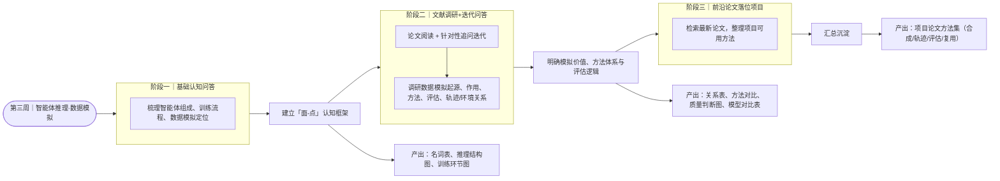
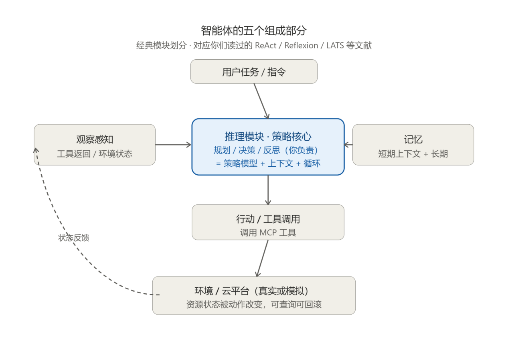
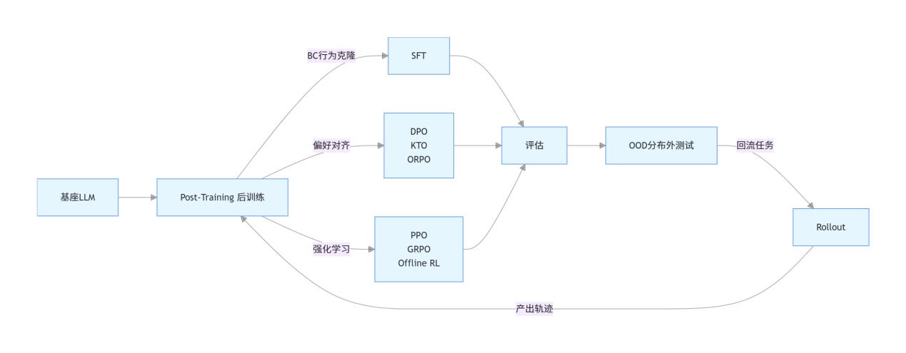
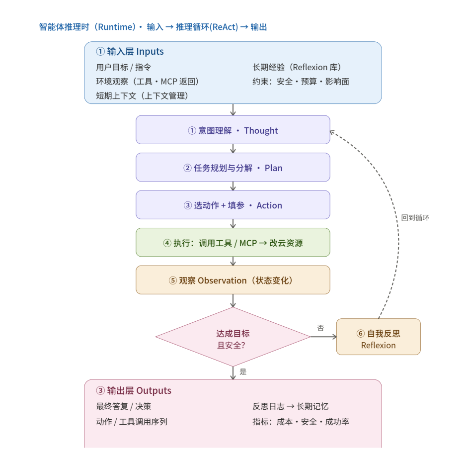
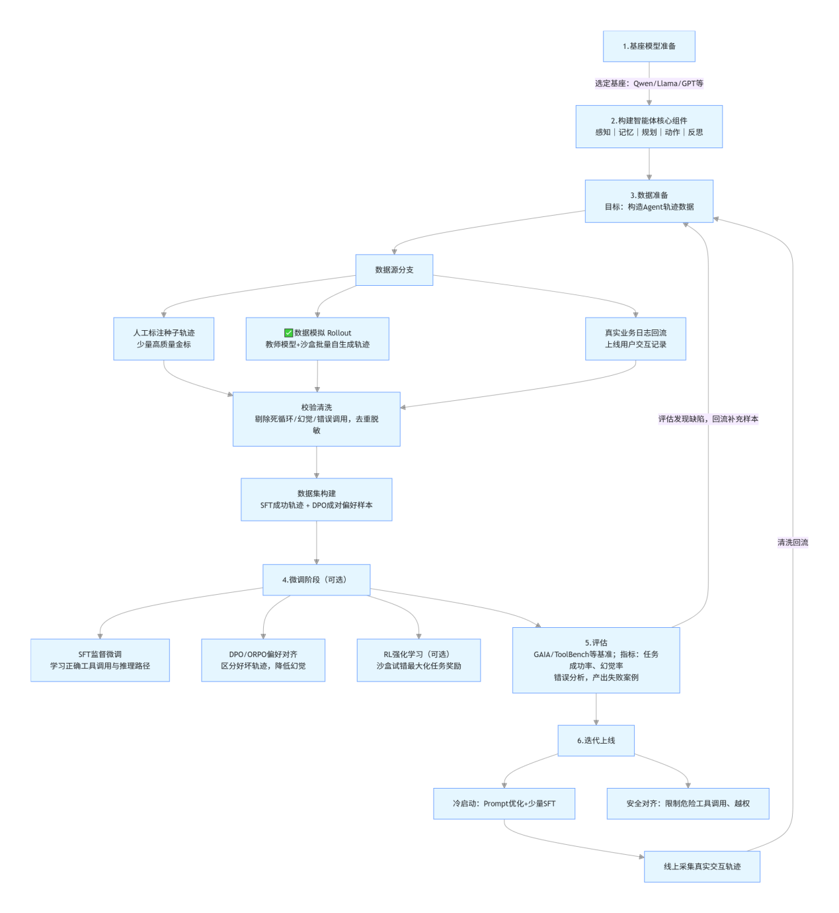
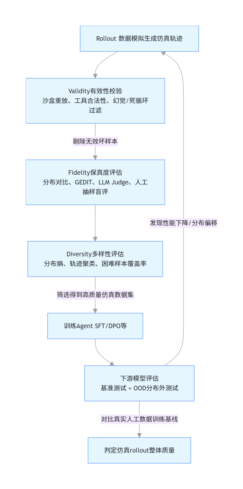
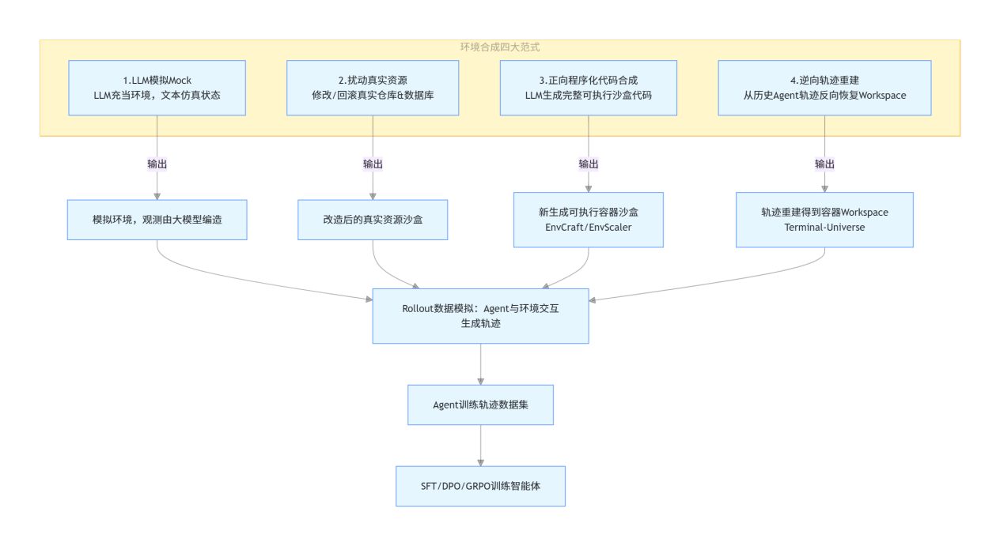
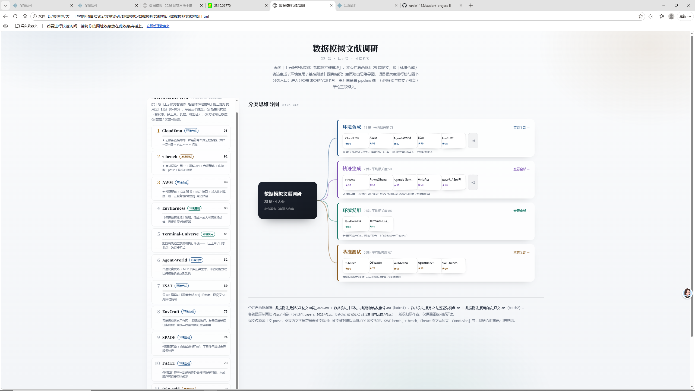

# 项目实践第三周工作记录

> **面向项目**：上云服务智能体 · 智能体推理模块
> **整理时间**：2026-09-21
> **结构**：一、STAR 摘要与下一步方法 → 二、工作流程图 → 三、详细流程。

***

## 一、STAR 摘要与下一步方法

### S｜情境（Situation）

项目实践小组做的是**一个上云服务的智能体**，我感兴趣的是**智能体推理**方面的工作。而老师说：“智能体的数据模拟
是我们这个项目
成败的关键
先看看最近的进展”

所以我得先了解：智能体推理本身要做哪些工作、当前面临什么问题；以及**数据模拟**在其中扮演什么角色、如何影响智能体推理的效果。

而数据模拟的问题是：由于隐私问题、数据稀缺和高昂的标注成本，在现实世界中获取高质量的指令数据极具挑战性。

### T｜任务（Task）

调研数据模拟前沿论文，找到与项目关联度高的可行方法。

### A｜行动（Action）

1. **与大模型多轮问答建立基础认识**：围绕「智能体的组成部分与智能体训练流程」「智能体推理步骤、推理与数据模拟关系」「数据模拟概念、方法、评估手段」三个方向提问，厘清数据模拟所处的训练环节。
2. **用「问题树」视角解读领域**：由一个问题派生多个问题、产生各种解决方法、再生新问题的思路，梳理数据模拟的发展脉络，并形成结构图。
3. **文献调研 + 多轮问答，逐步深入**：跑通「大模型给出论文 + 论文简述 → 阅读摘要 → 再询问大模型」的循环，依次弄清数据模拟的起源与标志性论文、模拟数据在训练中起作用的环节与判断方式、综述论文、与智能体推理的关系、直接生成轨迹的方法、环境合成的主流方法。
4. **形成项目论文方法集**：用 WorkBuddy 检索 前沿论文与经典方法，归纳出「环境合成 / 轨迹合成 / 评估指标 / 环境复用」四类方法与各自解决的问题，生成文献调研网页。

### R｜结果（Result）

归纳出四类论文方法集——「环境合成」论文解决后训练时环境稀缺与预训练轨迹稀缺问题，「轨迹合成」论文解决预训练时的方法快速验证，「评估指标」论文用于解决智能体评测问题，「环境复用」论文用于环境稀缺、进化问题。

找到两篇关联度高的论文：

《**Automated Synthesis of Cloud Emulators》，合成云模拟环境方法**

《*τ* **-bench: A Benchmark for Tool-Agent-User Interaction in Real-World Domains》，评估方法**

### 下一步（Next Steps）

> 以下为基于本周产出、面向项目的推进建议

1. **阅读代码**：阅读论文代码，判断可用性
2. **复现论文**：判断准确性
3. **思考如何应用于我们的项目。**

***

## 二、工作流程图

> 依据原记录的实际推进顺序绘制，并在图后补充各环节的产出对应关系。

### 流程说明

| 阶段           | 做法                                                  | 关键产出                                                                       |
| ------------ | --------------------------------------------------- | -------------------------------------------------------------------------- |
| 一 · 建立基础认识   | 与大模型多轮问答，主要从概念、环节、方法概述方向切入，目的是建立一个宏观认识              | 智能体推理名词表（12×4）、3 张结构图、数据模拟所处环节图                                            |
| 二 · 逐步探索数据模拟 | 文献调研 + 多轮问答，跑「给论文 → 读摘要 → 再问」的循环（6 个提问方向）           | 环境与轨迹关系表（6×3）、质量判断图、两篇论文比对表（5×3）、四种方法图、四种方法对比表（5×8）、直接生成轨迹 vs 环境合成对比表（9×3） |
| 三 · 方法集与落位   | 用 WorkBuddy 检索前沿论文（CloudEmu、τ-bench）、按照我理解的框架进行文献分类 | 项目论文方法集（用智能体生成的网页）：环境合成 / 轨迹合成 / 评估指标 / 环境复用。共25篇论文                        |

 

***

## 三、详细流程

### 项目实践第三周工作记录

**我的思路：**

> 了解智能体推理所做的工作，与如今所面临的问题。——产出表格与结构图
> 。数据模拟的任务定义，评测指标。——产出说明文档
> 。了解数据模拟在智能体推理中扮演的角色发挥的作用。——产出结构图与说明文档
> 。数据模拟是如何影响智能体推理效果的。——数据与论文支撑
> 。详细了解数据模拟的发展历程（问题链）与发展方向（树状格局）。——流程图，树状图，说明文档。
> 了解最新的各种方法进展。——树状图，论文与数据
> 最终利用论文，整理出一个方法对比表格。——表格
> 尽可能的在电脑上跑实验。——代码，数据，表格
> 总结——工作日志、工作流程图、工作文档、代码与数据

***

**1.与大模型进行多轮问答了解基础概念、建立初步认识。**

> prompt：“我的项目实践小组是做一个上云服务的智能体的。现在我负责智能体推理方面的工作。我需要了解，智能体的组成部分，智能体推理所负责的工作与任务，智能体推理在上云服务中需要做哪些工作。”

> Prompt：“一般智能体训练有哪些过程”

> Prompt：“我认为，一个领域的发展是呈现出一个“问题树”的结构的，即由一个问题生产多个问题，由此产生各种解决方法，然后又产生新的问题。请你按照这种思路来解读智能体数据模拟领域的发展，并最终呈现出对应的结构图
> ”

> .....

在这个过程中，我学习到了智能体的组成、智能体推理的流程、数据模拟所处环节与其作用。相当于建立了一个以智能体为面、以数据模拟为点的框架。帮助我在阅读论文时理解其工程上的安排。

**其中所学习到的知识：**

**智能体推理：**

| 名词                        | 全称                                                           | 含义                                                                                                       | 智能体场景下目标                                           |
| ------------------------- | ------------------------------------------------------------ | -------------------------------------------------------------------------------------------------------- | -------------------------------------------------- |
| SFT                       | Supervised Fine-tuning，监督微调                                  | 用输入 - 期望输出成对标注数据微调基础模型；属于行为克隆（Behavior Cloning）。在智能体中，输入 = 用户 query / 环境观测，输出 = 模型动作 / 推理 + 工具调用 / 多轮回复。 | 教会模型学会「怎么按照格式做推理、调用工具、完成多轮任务」，模仿高质量交互轨迹。           |
| Behavior Cloning（BC，行为克隆） | -                                                            | 强化学习经典范式：直接从专家轨迹 (o,a) 学习策略，不需要奖励函数；SFT 就是 BC 在 LLM 里最常用实现。                                              | 让模型复刻专家（仿真 / 人工）的状态 - 动作决策序列。                      |
| DPO                       | Direct Preference Optimization，直接偏好优化                        | 偏好对齐算法，不需要训练单独 reward model；输入同一个 prompt 下一对轨迹：chosen（好）/rejected（差），优化目标让模型更倾向输出 chosen 轨迹。             | 优化智能体行为偏好：优先选择正确规划、错误恢复、合理工具调用，拒绝无效 / 幻觉动作。        |
| KTO                       | Knowledge Trace Optimization，知识追踪优化                          | 偏好对齐算法，区分 “期望输出” 和 “不期望输出”，可单条样本独立打分，不需要成对样本，对仿真生成的失败轨迹更友好。                                              | 利用仿真产出的成功轨迹、失败轨迹做行为对齐。                             |
| ORPO                      | Odds Ratio Preference Optimization，比值偏好优化                    | 把 SFT 损失和偏好损失合并，一步完成监督 + 偏好学习，减少多阶段训练开销。                                                                 | 用仿真偏好对同时做能力学习 + 偏好对齐。                              |
| RL / PPO                  | Reinforcement Learning / Proximal Policy Optimization，近端策略优化 | 强化学习：策略模型与环境交互得到轨迹，根据奖励信号更新策略；PPO 是 LLM 经典 RL 算法。                                                        | 通过试错提升长 horizon 规划、错误恢复能力；真实环境昂贵，所以用模拟环境做 rollout。 |
| GRPO                      | Group Relative Policy Optimization，分组相对策略优化                  | 面向推理智能体的 RL，同一 prompt 生成多条 rollout，用组内相对优劣计算奖励，不需要外部 reward model。                                       | 适合多智能体仿真生成多条候选轨迹做组内对比。                             |
| Offline RL（离线强化学习）        | -                                                            | 直接使用预先收集好的历史交互轨迹池训练策略，训练时不和环境实时交互。                                                                       | 多智能体仿真提前批量生成大量轨迹，存入经验池，离线训练智能体策略。                  |
| Rollout                   | 轨迹采样 / 推演                                                    | 让智能体在环境 / 沙盒中执行任务，完整跑一遍：观测→推理→动作→新观测，生成完整交互序列。                                                           | 仿真的核心操作，产出训练用轨迹数据。                                 |
| Post-Training             | 后训练                                                          | 基础预训练完成之后所有微调 / 对齐阶段，包含 SFT、偏好对齐、RL。                                                                     | 把通用 LLM 改造为可执行任务的智能体。                              |
| OOD                       | Out-of-Distribution，分布外                                      | 测试任务 / 工具 / 场景，训练数据中完全没有见过。                                                                              | 检验智能体泛化能力，sim-to-real 的核心评测场景。                     |

**这些名词对应的训练环节**

**4.智能体推理时的流程**

数据模拟的背景：由于隐私问题、数据稀缺和高昂的标注成本，在现实世界中获取高质量的指令数据极具挑战性。

智能体训练流程——数据模拟所处的环节

***

**接着，通过文献调研-多轮问答，逐步探索数据模拟领域**

> Prompt：在智能体领域，数据模拟最早是在什么时候提出的，它的标志性论文是哪篇

> Prompt：我是指LLM 智能体、用模拟生成训练数据。那么请问，这个模拟出的数据，在模型训练的哪个环节中起到作用？怎么起到作用？怎么判断是否起作用？如今数据模拟面临的问题有哪几类？对应的解决办法有哪些？请以论文支撑

> Prompt：在智能体数据模拟方面有没有综述论文

> Prompt：智能体推理跟数据模拟有什么关系？

> Prompt：那除了通过环境合成来产生数据，是否有直接生成轨迹的方法呢？有哪些对应的论文，效果怎么样

> Prompt：请问在数据模拟时的环境合成方面有哪些主流方法
>
> .......

在这个环节中，经过多轮的“大模型给出论文+论文的简述”-“阅读摘要”-“询问大模型”的循环。我建立了对于数据模拟比较清晰的认识：1.数据模拟的重要性。2.数据模拟中“轨迹”与“环境”的关系。3.数据模拟的主流方法。4.数据模拟的评估指标与工程

**环境与轨迹的关系**

| 维度   | 轨迹 Trajectory               | 环境 Environment                 |
| ---- | --------------------------- | ------------------------------ |
| 本质   | 静态数据记录                      | 动态交互执行系统                       |
| 存在形式 | JSONL /messages 消息数组，可持久化存储 | 内存里运行的沙盒、工具服务，运行时才生效           |
| 读写方向 | 只读，训练时喂给模型学习                | 可交互：接收 Agent 动作 → 执行 → 返回观测    |
| 内容   | 记录每一步：思考、动作、观测、结果标签         | 工具引擎、任务规则、安全策略，不存历史记录          |
| 用途   | 训练模型（SFT/DPO）、离线评估          | 生成轨迹（rollout / 数据模拟），在线评估、上线推理 |

**数据模拟质量判断**

******

**两篇不同方法的论文比对**

| 项目   | EnvCraft                | TerminalUniverse                        |
| ---- | ----------------------- | --------------------------------------- |
| 环境来源 | 从零写环境 spec、交互原型，正向合成环境  | 从已有的原始 Agent 轨迹反向重建环境                   |
| 原始输入 | 场景文档、交互原型模板             | 大量历史 agent 执行轨迹（read/write/edit 文件操作记录） |
| 数据产物 | 环境 + 任务，适合 AgenticRL 训练 | 重建容器环境 + 单轮 / 跨仓库 / 多轮 SFT 轨迹           |
| 核心价值 | 生成大量全新、从未见过的仿真环境        | 盘活存量轨迹，把静态历史记录变成可交互环境，做二次任务挖掘           |

**数据模拟的四种方法**

**数据模拟四种方法的对比**

| 范式            | 核心逻辑                       | 观测来源     | 代表论文                          | 有效性 Validity | 保真度 Fidelity | 多样性 Diversity | 主要缺点                   |
| ------------- | -------------------------- | -------- | ----------------------------- | ------------ | ------------ | ------------- | ---------------------- |
| 1 LLM 模拟 Mock | LLM 充当环境，文本仿真状态            | 大模型生成    | AgentGym                      | 低，易幻觉漂移      | 中            | 高             | 状态不一致，不可重放，少用于正式训练     |
| 2 扰动真实资源      | 基于真实仓库 / 数据库做修改回滚          | 真实系统执行   | SWESmith,SWEGym               | 很高           | 最高           | 受原始素材限制       | 扩量受素材库约束，版权问题          |
| 3 正向程序化代码合成   | LLM 生成完整可执行沙盒代码            | 沙盒代码真实执行 | EnvCraft、EnvScaler、EnvFactory | 高            | 中高           | 最高，可生成全新领域    | 生成代码存在 bug，需要严格审计，算力开销 |
| 4 逆向轨迹重建      | 从历史 Agent 轨迹反向恢复 Workspace | 重建容器执行   | TerminalUniverse              | 高            | 高，源于真实交互痕迹   | 中等，域被输入轨迹约束   | 轨迹信息不足会导致重建残缺          |

**直接生成轨迹与生成环境的区别**

| 维度                | 直接生成轨迹（免执行）        | 环境合成 + Rollout（EnvCraft / TerminalUniverse） |
| ----------------- | ------------------ | ------------------------------------------- |
| 观测 Observation 来源 | LLM 脑补 / 世界模型想象    | 沙盒 / 容器真实执行输出                               |
| 是否需要搭建沙盒环境        | ❌不需要               | ✅需要容器 / 代码沙盒                                |
| 轨迹可重放校验           | ❌不可重放，无法验证真假       | ✅可以重放校验，过滤幻觉轨迹                              |
| 适合训练范式            | 仅适合 SFT；RL 噪声过大不推荐 | SFT / DPO / GRPO/AgenticRL 都支持              |
| 长 horizon 有状态任务表现 | 差，容易状态漂移、幻觉        | 好，状态由代码严格维护                                 |
| simtoreal gap     | 大，真实环境评测容易掉点       | 较小；取决于环境合成质量                                |
| 扩量成本              | 很低                 | 较高（容器、代码审计）                                 |
| 主流定位              | 预热、数据增强补充          | AgenticRL 训练主数据源                            |

而在这个过程中，我利用WorkBuddy检索了最近2026.7月之后的论文，在这些论文中形成一套针对于我们这个项目的论文方法集——“环境合成”论文解决后训练时环境稀缺与预训练轨迹稀缺问题。“轨迹合成”论文解决预训练时的方法快速验证。“评估指标”论文用于解决智能体评测问题。“环境复用”论文用于环境稀缺、进化问题。

***

## 反思

1.不应该在第一阶段花太多时间，主要是类似的问题问了许多次——说明没有抓到重点

2.着急于从论文入手却看不太明白——说明要先了解基础概念

3.在总结成果上花了许多时间——没有形成一个体系。

附：

项目开源地址：[runlin1113/student\_project\_II](https://github.com/runlin1113/student_project_II)

参考文献：

YAO S, SHINN N, RAZAVI P, et al. τ-bench: A Benchmark for Tool-Agent-User Interaction in Real-World Domains\[R/OL]. arXiv preprint, 2024. arXiv:2406.12045.（后被 EMNLP Findings 2025 收录）

BHATNAGAR A, YANG Z, MCCLURE S, et al. Automated Synthesis of Cloud Emulators\[R/OL]. arXiv preprint, 2026. arXiv:2608.23842.

ZENG Y, YOU S, FENG J, et al. EnvCraft: Synthesizing Executable Environments in Agentic RL for Claw-like Agent\[R/OL]. arXiv preprint, 2026. arXiv:2609.05576.

JIMENEZ C E, YANG J, WETTIG A, et al. SWE-bench: Can Language Models Resolve Real-World GitHub Issues?\[R/OL]. arXiv preprint, 2023 (revised 2024). arXiv:2310.06770.（ICLR 2024 收录）

WU J, ZHANG Z, ZHANG B, et al. Terminal-Universe: Turning Agent Trajectories into Scalable Terminal Environments\[R/OL]. arXiv preprint, 2026. arXiv:2609.04148.
