# 第四周项目实践工作记录

> **转换说明**：本文由 `第四周项目实践工作记录.docx` 转换而来。
> - 原文的 **12 张图（image1–image12）全部保留**，存放于 `assets/` 目录；
> - 原文中**以截图形式插入的表格**（环境生成 11 篇对比表、三种测试方法对比表）已按约定**转写为 Markdown 表格**（表 1、表 4），原始截图保留于文末附录；
> - 原文 3 张 Word 原生表格原样转为 Markdown 表格（表 2、表 3、表 5）；
> - 转换者补充的内容均以 **📝 补充** 标注，其余为原文内容（仅做标题分层与少量排版整理）。

**本周速览**：总结上周四类方法调研 → 精读 CloudEmu（架构三阶段 + L0/L1/L2 验证基准）→ 发现"API 仿真 vs OS 沙箱"的环境层次之分 → 产出面向 Cloud-Agent 的六阶段测评方法与三种测试方法参考表。

---

## STAR 法则

- **S（Situation 背景）**：王同学搭建好了模拟器平台，我调研了数据模拟文献。
- **T（Task 任务）**：
  1. 从文献中提取出测试模拟器平台的方法，便于测试我们的模拟器；
  2. 分析 CloudEmu（最新云模拟器论文方法），主要分析其架构设计与测试方法；
  3. 将整理出的内容以流程图与表格的形式呈现。

---

## A（Action）

### 1. 总结上周的调研结果

#### 1.1 四类方法对应智能体训练的不同流程

上周进行了数据模拟的调研，调研的论文可以分为**「环境复用」「环境生成」「轨迹生成」「基准测评」**四类。这些论文所提出的方法其实针对于智能体训练的不同流程：比方说，在我们训练初期需要大量的任务轨迹，那么**轨迹生成**就可以帮助我们快速低成本地获得训练所需要的数据；而**环境生成**则适合我们后训练进行对齐的时候提供环境。

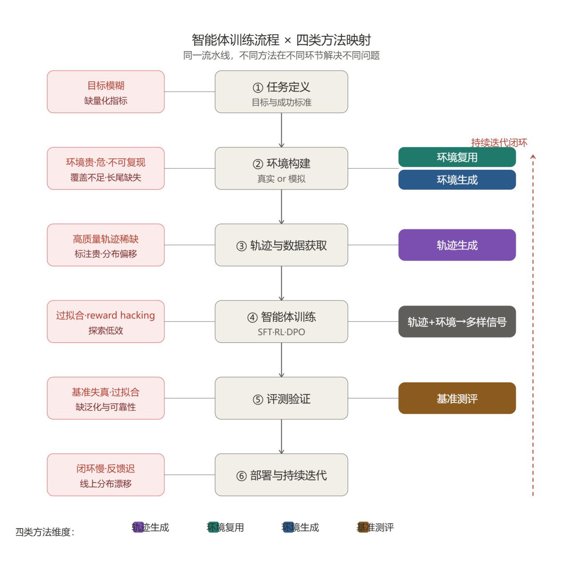

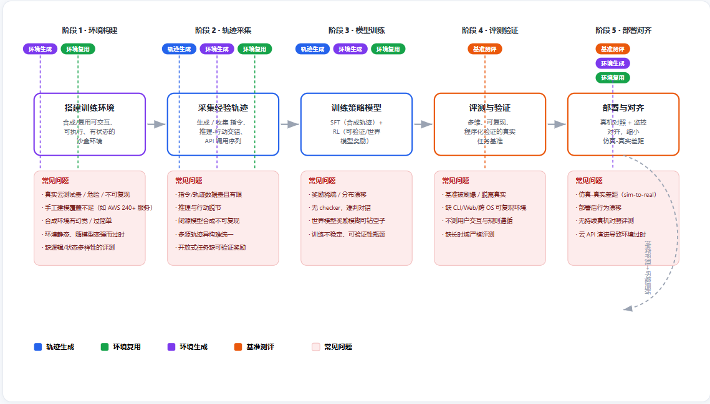

**图 1–2　各个方法所对应的训练流程**

> 📝 补充（读图要点）：
> - 图 1 把训练拆成六阶段流水线：①任务定义 → ②环境构建 → ③轨迹与数据获取 → ④智能体训练 → ⑤评测验证 → ⑥部署与持续迭代；左侧红框为各阶段常见问题，右侧色块为四类方法的介入位置——**环境复用（青）与环境生成（蓝）主攻②环境构建，轨迹生成（紫）主攻③数据获取并反哺④训练，基准测评（棕）主攻⑤评测验证并支撑⑥迭代**。
> - 图 2 进一步给出五阶段（环境构建 → 轨迹采集 → 模型训练 → 评测验证 → 部署对齐）中每一段的"常见问题"清单（如真实云贵/险/不可复现、轨迹噪声与分布偏移、基准抽检/脱离真实等），并标注每段可用哪几类方法解决。
> - 一句话：**同一流水线，不同方法在不同环节解决不同问题。**

#### 1.2 四个方法维度下，不同论文各自侧重解决什么问题

在这四个方法维度的划分下，不同论文又侧重于解决不同的问题。为更加直观地体现，以下用表格呈现（原文此处为两张截图，现转写为 Markdown 表格；两截图合起来是「环境生成」一类的 11 篇论文）：

**表 1　「环境生成」11 篇论文对比**（原文截图 image3 + image4 转写）

| 具体方法（论文） | 针对问题 | 解决方法 | 评测方法 | 实际效果 | 项目关联 | 机会点 | 启发 |
|---|---|---|---|---|---|---|---|
| **CloudEmu** ⭐ 神经符号+云模拟器（arXiv:2608.23842） | 云环境稀缺成危险/贵；现成模拟器覆盖不全 | LLM 读云文档 + 符号抽象抑制幻觉 + 真云当 oracle 做测试修复对齐 | AWS/GCP 服务真实率与准确率 | 覆盖率与准确率双超 LocalStack | ★与项目直接同构，优先精读 | 造云运维模拟器+可信奖励 | 神经符号+真云 oracle 是合成可信环境范本 |
| **EnvCraft** 沙盒+拓扑感知数据引擎（arXiv:2609.05576） | 跨控制台长程运维环境难造 | 环境合成引擎生成可执行沙盒（状态+工具+文档）+ 拓扑感知数据引擎采样工具链 | claw 类基准、通用工具使用 | 139 环境/~20K 任务；claw +11.9%、通用工具 +8.0% | 跨控制台长程运维问题定义同构 | 造跨云控制台训练环境 | 沙盒隔离+拓扑感知保证任务可执行 |
| **FACET** 容器化任务共享底层（arXiv:2608.18580） | 终端任务中指令/解法/验证器三者常不一致 | 容器状态作为三者共享底层，先建环境再派生其余 | 350 任务端到端产出率、6,020 任务释出 | 70.0% 端到端产出率；释出 6,020 终端任务 | 云运维指令/解法/验证器统一以容器状态为真值 | 用真实云状态做唯一真值源 | 环境是唯一的真值来源 |
| **AWM** Agent World Model（代码+SQL 环境）（arXiv:2602.10090，ICML 2026） | 环境状态不可靠/不可查 | 代码驱动 + SQL 数据库环境，状态可查→奖励可靠 | 1,000 个环境、SQL 库比对 | 1,000 个代码+SQL 环境；「状态可查→奖励可靠」立论出处 | 云状态可靠性=奖励可靠性的论据 | 云数据库状态作验证器 | 状态可查是奖励可靠的前提 |
| **Agent-World** 自进化竞技场+MCP 工具（arXiv:2604.18292） | 环境固定会饱和 | 真实数据库+工具生态合成任务 + 多环境 RL 自进化闭环（诊断弱点→定向学习） | 1,978 环境/19,822 工具/23 基准 | 1,978 环境/19,822 工具；23 基准超越 | 云运维能力缺口驱动持续合成任务 | 环境驱动数据飞轮 | 环境应随模型弱点持续生长 |
| **EnvScaler** 程序化合成+规则验证奖励（arXiv:2601.05808） | 合成环境成本高、状态不可控 | SkelBuilder 质量双智能体评估 + ScenGenerator 规则验证 | 191 环境/~7K 场景、3 基准 | 191 环境/~7K 场景；3 基准提升 | 云环境程序化合成+规则验证奖励 | 低成本大规模造云环境 | 规则验证奖励避免 reward hacking |
| **LogicEnvGen** 逻辑驱动多样性环境（arXiv:2601.13556） | 任务多样性不足、状态覆盖不全 | 行为计划决策树 + 逻辑轨迹组合 + CSP 约束求解实例化（具身 AI） | 逻辑覆盖率、故障检测率 | 逻辑覆盖 1.04–2.61×；故障检测 +4~68% | 逻辑多样性方法可迁移到云任务组合 | 用约束求解举云任务情形 | 抽象逻辑层穷举保证多样性 |
| **InfiniteWeb** 统一规格+TCTDD（arXiv:2601.04126） | Web/控制台环境合成一致性差、功能 bug 难抓 | 统一规格 + 任务驱动测试开发（TCTDD）+ 可验证评测器 | OSWorld、Online-Mind2Web | OSWorld +6.9%、Online-Mind2Web +5.7%、~$1.93/站 | Web/控制台环境合成直接范本 | 云控制台环境三段式落地 | TCTDD 让 bug 在生成时即被抓 |
| **Environment Evolution** off-policy 提难度（arXiv:2609.04128） | 环境固定，模型变强后无挑战 | off-policy 提升环境难度 + 代谢调度，双门控反馈保障可解性 | Terminal-Bench 2.1 | Qwen3.6-27B +14.4、35B-A3B +18.0 | 云环境随模型共进化 | 诊断弱点→定向加难度 | 环境难度要跟着模型走 |
| **SPADE** 环境设计可学习+自博弈（arXiv:2608.19197） | 环境设计与智能体能力不匹配 | 一个 LLM 分饰环境设计与推理 agent，奖励用 hint-based regret，自博弈 | 8 个通用基准、BFCL-v4、ACEBench-Agent | 8 基准平均 +5.3；BFCL-v4 多轮 +5.7、ACEBench-Agent +13.9 | 让环境设计随训练自适应 | 自适应课程生成云任务 | 环境设计本身可学习 |
| **AgenticGameDev** 造游戏=数据引擎（arXiv:2608.25518） | 轨迹缺过程真值、易刷分 | 让 agent 造游戏，开发过程留协议级 trace（意图/中间状态/事件日志） | 引擎级 ground-truth 状态/物理/事件校验 | 轨迹自带引擎级真值，不可伪造 | 云运维「世界模型+数据引擎」雏形 | 把运维过程当可验证数据引擎 | 过程 trace 比终端更值钱 |

> 注：image3 中 EnvScaler 一行在截图底部被截断，缺失文字已按调研网页数据补全；SPADE 的"8 个通用基准"同此处理。

> 📝 补充：这张表与上周产出的对比矩阵一脉相承。**共同规律**：环境可信度的核心都在于"真实可执行 + 状态可查"，奖励应来自状态比对/规则验证而非 LLM 当裁判（防 reward hacking）；与我们上云服务智能体项目最同构的是 **CloudEmu（上层 API 状态机）+ AgenticGameDev（世界模型+数据引擎）**。

---

### 2. CloudEmu 详细解读

详细解读 CloudEmu——这篇论文所解决的问题是如何模拟云服务器，和我们的项目关联度最高。

#### 2.1 论文的行文思路

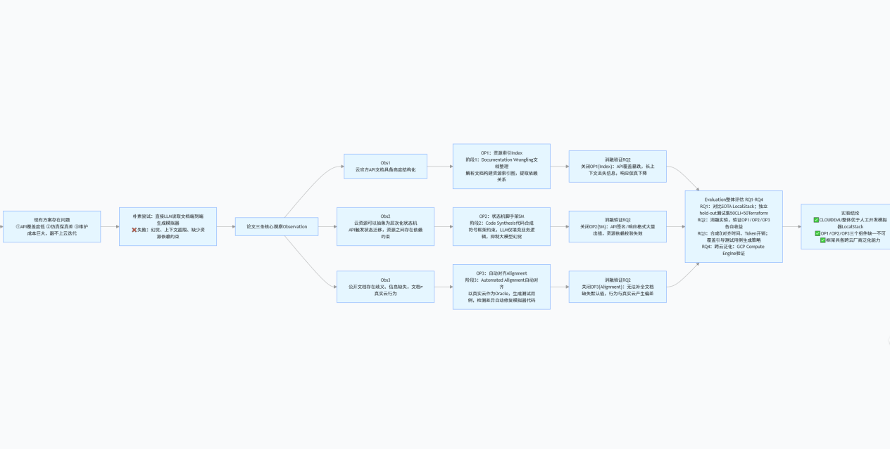

**图 3　CloudEmu 论文行文思路**

论文指出现有模拟器需要与现有人工模拟的缺陷，并结合观察给出了"用大语言模型做模拟器"的机会点。

#### 2.2 CloudEmu 的 Pipeline（三阶段）

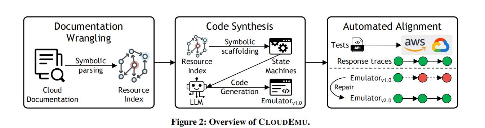

**图 4　CloudEmu 的 pipeline**

- **阶段 1（Documentation Wrangling 文档整理）**：通过云厂商公开的 API 文档建立起**资源索引图**。这解决了大模型直接读文档存在的缺陷：1）上下文信息过大；2）容易丢失内容。方法是构建**索引节点和索引边**。这种建立数据结构的方法好处在于：1）可以遍历；2）足够确定；3）模块化；4）确定依赖关系。
- **阶段 2（Code Synthesis 代码合成）**：通过建立好的资源索引图来编写模拟器代码。方法是开发一套**状态机脚手架**，这解决了大模型直接生成代码会存在幻觉、状态量丢失等问题。
- **阶段 3（Automated Alignment 自动对齐）**：与真实云进行对齐。流程为：**生成测试 → 双端执行 → 定位差异 → 修补模拟器 → 循环直到对齐**。

> 📝 补充：三个阶段是一条"**文档 → 结构 → 代码 → 真值**"的链路——资源索引图是"可遍历的确定性结构"，状态机脚手架是"防幻觉的生成约束"，真云对齐闭环是"可信性的最后闸门"。对我们 Cloud-Agent 的上层（云控制面 API 仿真）而言，这条链路可以直接套用。

#### 2.3 论文验证有效性的流程

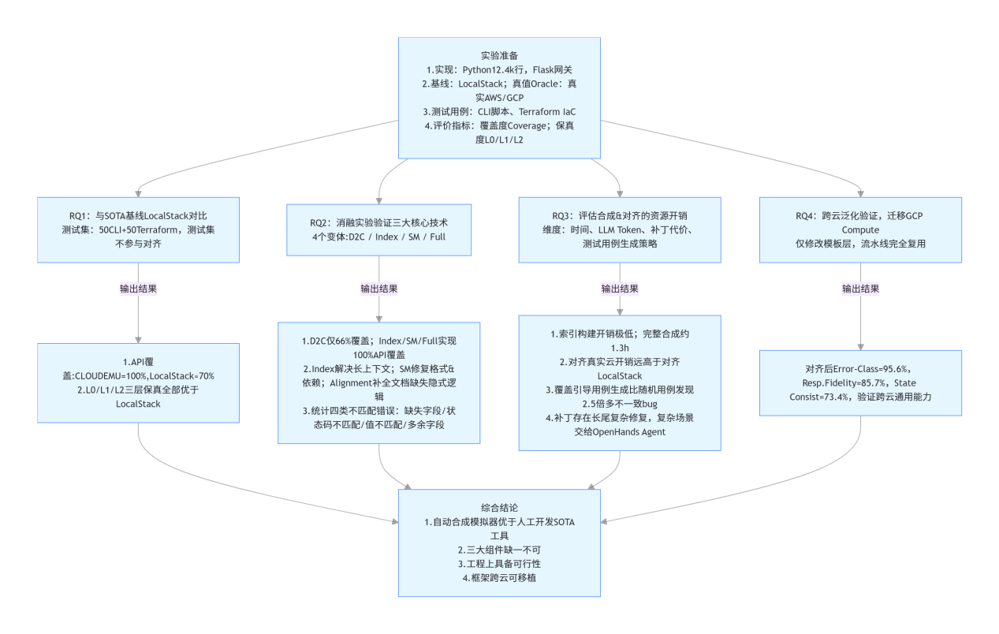

**图 5　CloudEmu 验证有效性的流程（RQ1–RQ4）**

> 📝 补充（图 5 的四个研究问题与结论速查表）：
>
> | 研究问题 | 实验设置 | 输出结果 |
> |---|---|---|
> | **RQ1** 与 SOTA 模拟器（LocalStack）对比 | 测试集：50 CLI + 90 Terraform（不参与对齐） | API 覆盖：CloudEmu=100%，LocalStack≈70%；L0/L1/L2 三层保真全部优于 LocalStack |
> | **RQ2** 消融实验验证三大核心技术 | 4 个变体：D2C / Index / SM / Full | D2C 仅 66% 覆盖；Index 解决上下文丢失、修复格式错位；SM 补全金文档缺陷与格式逻辑；四类不匹配错误：缺失字段/状态码不匹配/值不匹配/多余字段 |
> | **RQ3** 评估合成对齐的资源开销 | 维度：时间、LLM Token、补丁代价、测试用例生成策略 | 索引构建开销极低；完整合成 1.3h；对齐真实云开销高于对齐 LocalStack；前期随机用例可发现 2.5 倍不一致 bug；复杂场景交给 OpenHands Agent |
> | **RQ4** 跨云泛化验证（迁移 GCP Compute） | 仅修改数据层，流水线完全复用 | 对齐后 Error-Class=95.6%、Resp.Fidelity=85.7%、State Consist=73.4%，验证跨云通用能力 |
>
> **综合结论**：自动合成模拟器优于人工开发 SOTA 工具；三大组件缺一不可；工程上具备可行性；框架跨云可移植。

#### 2.4 与人工云模拟器（LocalStack）的对比

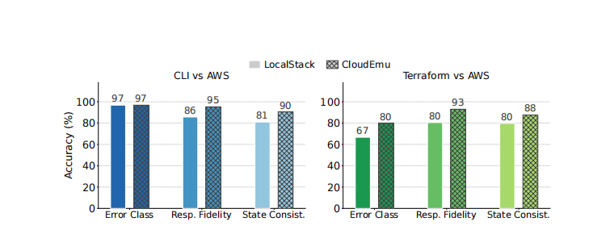

**图 6　与人工云模拟器的对比**

> 📝 补充（读图）：CLI vs AWS 下三类指标 CloudEmu 分别为 97 / 95 / 90（LocalStack 97 / 86 / 81）；Terraform vs AWS 下为 80 / 93 / 88（LocalStack 67 / 80 / 80）——**CloudEmu 全面占优，且在"状态一致性（State Consistency）"与 Terraform 路径上的领先幅度最大**，说明符号状态机 + 真云对齐带来的收益主要体现在深层状态保真上。

#### 2.5 消融实验结果

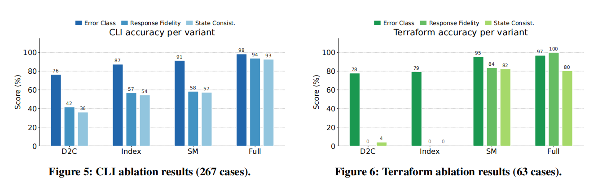

**图 7　消融实验结果**

> 📝 补充（读图）：CLI 消融中 D2C（直接生成）仅 76/42/36，逐个叠加 Index、SM 后升至 87/57/54、91/58/57，Full 达 **98/94/93**；Terraform 消融中 D2C 的 Response/State 两项几乎为 0，Full 达 **97/100/80**——**三大核心组件缺一不可，且越靠后的状态类指标越依赖完整方案**。

#### 2.6 论文所用测评基准（L0/L1/L2 三层保真指标体系）

**表 2　CloudEmu 测评基准：指标定义与通过判定**

| 指标 | 层级 | 定义 | 计算方式 | 通过判定条件 | 失败示例 |
|---|---|---|---|---|---|
| 覆盖度 Coverage | — | 模拟器可仿真 API 的完备程度（只衡量 API 是否被实现，不衡量实现正确性） | Coverage = 支持 API 数 ÷ 云服务全部 API 总数 | 目标 API 有对应实现即可计为覆盖 | EC2 共 756 个 API，LocalStack 仅实现 244 个 → 覆盖度≈32% |
| 保真度 Fidelity | L0 ErrorClass 错误类别 | API 调用成功/失败的状态及错误码与真实云完全一致 | 用例内每一次 API 调用的错误码与 Oracle 一致（不校验返回字段） | 真实云报错→模拟器报相同错误码；真实云成功→模拟器也成功 | DeleteVpc 因存在子网应返回 DependencyViolation，模拟器却返回成功 |
| 保真度 Fidelity | L1 Response Fidelity 响应保真 | 在 L0 基础上，业务关键响应字段取值与真实云完全一致 | 满足 L0 ＋ 关键响应字段值一致（自动忽略时间戳、随机资源 ID 等动态字段） | 返回报文的业务字段逐项等于 Oracle | 真实 AWS 返回 CidrBlockAssociationSet 嵌套对象，模拟器直接省略该字段 |
| 保真度 Fidelity | L2 State Consistency 状态一致性 | 在 L1 基础上，模拟器内部全部资源状态与真实云状态等价 | 满足 L1 ＋ 内部资源模型、资源间依赖、子资源关联与 Oracle 等价 | 内部保存的资源状态与真实云一致，后续 API 行为自然正确 | CreateSubnet 返回字段正确，但内部未记录子网隶属于该 VPC，导致后续删 VPC 不触发依赖报错 |

> 📝 补充：L0 ⊂ L1 ⊂ L2 是**逐层递进**的保真度体系，从"错误码对"到"响应字段对"再到"内部状态等价"。这套指标可以直接作为我们 Cloud-Agent **上层 API 仿真层**的验收标准（对应我们的 API-Fidelity），其中 L2 尤其关键——它保证"后续 API 行为自然正确"，正是防 reward hacking 的机制设计。

---

### 3. 转向：对我们 Cloud-Agent 云模拟器的有效性测评

接着，了解到组员已经实现了一个云模拟器，于是将工作的重点转向如何对这个云模拟器进行有效性测评。

我首先想到 CloudEmu 是如何验证的，然后是调研的"环境合成"中的论文里它们是如何验证其环境的有效性的。

但是在与大模型对话过程中发现，**环境模拟的环境也存在着区别**：如 AWS、CloudEmu 模拟的是**云控制面 API 层**，在这样的环境下训练的是智能体的**调用工具能力**；但要训练出执行能力还不够，还需要有**下层 Docker 沙箱**。

而小组同学已经搭建好的模拟器是**集成了 API 层与 Docker 沙箱**的。所以就不能照搬其他环境生成论文的测试方法，而是将其**思想、数据集**进行运用：

- 在测试模拟器的**上层 API 响应**阶段，可以参考 CloudEmu 中"错误正确双双与真实服务对齐"的方法；
- 在测试**沙箱执行**阶段，可以参考 Terminal-Bench 的思想。Terminal-Bench 是对大模型沙箱执行能力进行测试的数据集，我们可以**反过来用**其提供的任务数据（89 个人工校验任务），通过与真实 KVM 上对比来计算 **OS-Sandbox-Fidelity（保真度）**，然后通过消融实验测试每个阶段的性能。

值得一提的是，由于所调研的环境生成论文中所模拟的环境**除了 CloudEmu 其它都不是模拟云服务器的**，所以它们的测试集并不能拿来测试云模拟器的有效性，只能借鉴它们测试的线路与造数据的思路；而在我们智能体训练的时候，则可以用它们的数据集来测试智能体调用工具接口的能力。

> 📝 补充（一句话结论）：**API 层环境训练"会调接口"，真实 OS 沙箱训练"会动手操作"**——两层能力面不同、缺一不可；因此测试也要分两层设计，再用消融实验归因。

#### 3.1 API 仿真与沙箱的对比

**表 3　调用接口能力 vs 操作系统操作能力**（原文原生表格）

| 对比维度 | 调用接口能力（API 调用） | 操作系统操作能力（Shell/OS 操作） |
|---|---|---|
| 动作本质 | 发送请求报文，接收结构化 JSON 响应，消息交互 | 系统调用（syscall），直接修改本机文件、进程、socket 等 OS 实体 |
| 状态存放位置 | 远端服务/模拟器的数据库、内存 | 本机操作系统：文件系统、进程表、网络栈 |
| 执行载体 | 不需要真实操作系统；AWM/LocalStack 纯数据库模拟器就可以跑 | 必须真实操作系统沙箱（Docker/KVM）；纯 API 模拟器完全无法模拟 |
| 故障来源 | API 参数错误、权限不足、资源依赖冲突、限流；故障全部在控制平面 | 文件权限、端口监听错误、进程崩溃、磁盘满、软件报错；故障发生在实例内部 |
| 观测返回 | 结构化 JSON | stdout/stderr、文件内容、进程状态、网络响应；文本 + 真实系统状态 |
| 模拟成本 | 极低，数据库记录即可，毫秒级重置 | 高，需要启动容器/虚拟机；需要管理文件、进程生命周期 |
| 典型动作 | CreateEcs、ListEcs、调用 CRM/订单 MCP 工具 | apt install nginx、echo > index.html、systemctl start nginx、curl |
| 模拟器边界 | AWM、LocalStack 可完整模拟 | AWM 做不到；必须 Docker/KVM 沙箱 |

#### 3.2 智能体在两种环境中的训练/执行流程对比，与总结出的测评方法

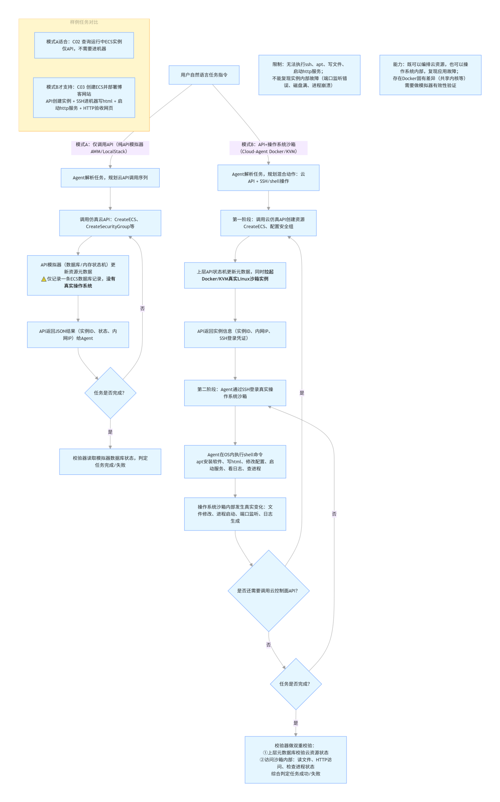

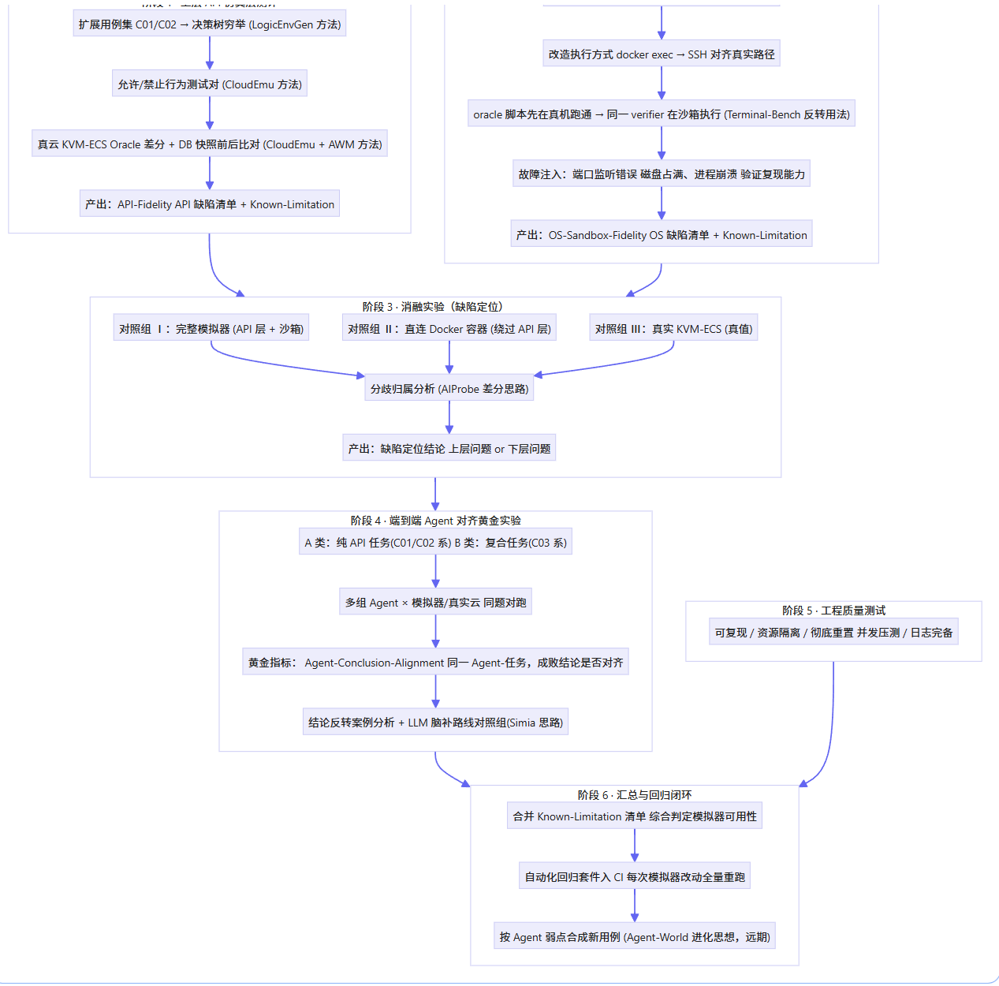

以上为总结出的测试 Cloud-Agent 的方法。

> 📝 补充（图 8 读图要点）：
> - **模式 A（纯 API，AWM/LocalStack 类）**：Agent 解析任务→模拟云 API（CreateECS/CreateSecurityGroup 等）→API 网关校验→数据库状态转移→返回 JSON。**没有真实操作系统，反证举要**：无法执行 systemctl、apt 等系统命令，读写磁盘、部署应用、排查端口监听等实例内部故障均无法覆盖。
> - **模式 B（API + 沙箱，Cloud-Agent Docker/KVM 类）**：第一步通过云 API 创建资源（同步打通 Docker/KVM 真实环境），第二步 Agent 通过 SSH 登录真实操作系统执行 shell/apt/systemctl 等命令，操作系统沙箱内部发生变化（文件修改、进程启动、端口监听、日志生成），最后**校验器双重校验**：①上层云数据模拟器云资源状态；②沙箱内真实系统状态（远端文件内容、进程列表、HTTP 响应、端口监听），综合判定任务成功/失败。
>
> 📝 补充（图 9 六阶段测评法一览）：
>
> | 阶段 | 内容 | 产出 |
> |---|---|---|
> | 1 上层 API 测试 | 扩展用例 C01/C02（LogicEnvGen 决策树穷举）→ 允许/禁止行为对（CloudEmu 法）→ 真云 KVM-ECS Oracle 差分 + DB 快照前后比对（CloudEmu+AWM 法） | API-Fidelity、API 缺陷清单 + Known-Limitation |
> | 2 下层沙箱测试 | 改造执行方式 docker exec→SSH 对齐真实路径；oracle 脚本先在真机跑通 → 同一 verifier 在沙箱执行（Terminal-Bench 反转用法）；故障注入（端口监听错误/磁盘占满/进程崩溃）验证复现能力 | OS-Sandbox-Fidelity、OS 缺陷清单 + Known-Limitation |
> | 3 消融实验（缺陷定位） | 对照组Ⅰ：完整模拟器（API 层+沙箱）；对照组Ⅱ：直连 Docker 容器（绕过 API 层）；对照组Ⅲ：真实 KVM-ECS（真值）；分歧归属分析（AIProbe 差分思路） | 缺陷定位结论：上层问题 or 下层问题 |
> | 4 端到端 Agent 对齐黄金实验 | A 类：纯 API 任务（C01/C02 系）；B 类：复合任务（C03 系）；多组 Agent × 模拟器/真实云同题对跑；黄金指标 **Agent-Conclusion-Alignment**（同一 Agent-任务，成败结论是否对齐）；结论反转案例分析 + LLM 脑补路线对照组（Simia 思路） | ACA 值 + 反转案例报告 |
> | 5 工程质量测试 | 可复现 / 资源隔离 / 彻底重置 / 并发压测 / 日志完备 | 工程质量报告 |
> | 6 汇总与回归闭环 | 合并 Known-Limitation 清单，综合判定模拟器可用性；自动化回归套件入 CI；按 Agent 弱点合成新用例（Agent-World 进化思想，远期） | 评估报告 + CI 回归套件 |

#### 3.3 三种测试方法的对比与应用

以下为三种测试方法的对比与应用（原文此处为截图，现转写为 Markdown 表格）：

**表 4　Terminal-Bench / CloudEmu / 其他环境生成论文：测试对象、方法与对 Cloud-Agent 的参考**（原文截图 image12 转写）

| 来源 | 测试对象 | 测试方法 | 对测试我们 Cloud-Agent 的方法参考 |
|---|---|---|---|
| **Terminal-Bench** | Docker 容器内 shell 终端 Agent 能力（真实执行，读容器真实状态判成败） | 89 个人工校验任务；每任务含 Dockerfile + oracle 参考脚本 + pytest verifier；verifier 读容器内部状态（文件/进程/端口/HTTP）判成败，**不看 Agent 文本** | ① 反转用途测「下层 OS 沙箱」本身：真 KVM 先跑通 oracle 作真值 → 沙箱跑同一 verifier 比语义 → 得 OS-Sandbox-Fidelity；② 过滤 systemd/内核任务；③ 执行方式改 SSH 对齐真实路径；④ 故障注入（端口/磁盘/进程）测沙箱复现能力 |
| **CloudEmu** | 云 API 控制面仿真器保真度（无 OS） | 神经符号状态机 + 真云 oracle 对齐：测试→分歧检测→溯源→修复闭环；允许/禁止行为双对齐（含错误码/消息）；差分测试 L0/L1/L2 | ① 上层 C01/C02 用同法造：文档摄取→状态机填洞→真云差分；②「允许/禁止行为+错误码双对齐」作 API-Fidelity 判据；③ 真云 oracle 闭环是上层缺失、应补齐的实验设计作报告模板 |
| **其他环境生成论文** | 各自领域环境：通用工具(AWM)、Web(FACET/InfiniteWeb)、游戏(AgenticGameDev)、逻辑(LogicEnvGen)、LLM 脑补(Simia) 等 | 各不相同：状态差分奖励(AWM)、真实容器终端(FACET)、TCTDD(InfiniteWeb)、CSP/决策树(LogicEnvGen)、引擎即真值(AgenticGameDev)、LLM 扮演环境(Simia) | ① AWM：合成流水线+状态差分 verifier → 造自己的云任务集（**非搬其数据**）；② FACET：任务四件套同源 → 治 C03 不一致；③ AgenticGameDev：引擎+执行双验证 → 校验器设计 + 消融三对照定位缺陷层；④ Simia：作「脑补 vs 真实」对照基线量化 sim-to-real；⑤ EnvScaler：双 agent 质量门槛过滤用例；⑥ LogicEnvGen：边界穷举补 C01/C02 错误码覆盖 |

#### 3.4 Terminal-Bench 的任务集构成

**表 5　Terminal-Bench 任务集分类（共 89 题）**（原文原生表格）

| 类别 | 数量 | 典型任务说明（对 CloudAgent 模拟器测试有价值） |
|---|---|---|
| Software engineering 软件工程 | 26 | 编译项目、改写程序、构建代码、单元测试 |
| System administration 系统管理 | 9 | ✅非常适合测试操作系统模拟器：配置网络、后台常驻服务、web 服务部署、进程管理、用户权限配置（类似 C03 博客部署） |
| Scientific computing 科学计算 | 8 | 数值计算、仿真脚本运行 |
| Security 安全 | 8 | 漏洞复现、日志取证、权限加固 |
| Data science 数据科学 | 8 | 数据清洗、表格处理 |
| Debugging 调试 | 5 | ✅故障复现：程序报错、配置错误排查，适合做模拟器故障注入测试 |
| File operations 文件操作 | 5 | 文件创建、权限、软链接、批量处理 |
| Model training 模型训练 | 4 | ML 模型训练脚本运行 |
| Mathematics 数学 | 4 | 脚本数值运算 |
| Data processing 数据处理 | 4 | 文本批量处理 |
| Machine learning 机器学习 | 3 | 推理脚本执行 |
| Games 游戏 | 1 | 终端小游戏 |
| Personal assistant 个人助手 | 1 | 自动化脚本 |
| Optimization 优化 | 1 | 性能调优脚本 |
| Data querying 数据查询 | 1 | SQL / 文本查询 |
| Video processing 视频处理 | 1 | 视频处理脚本 |

以上是 Terminal-Bench 的任务集。

> 📝 补充：89 题中**系统管理（9 题）+ 调试（5 题）共 14 题**与 C03（创建 ECS → SSH → 部署博客/排障）最贴近，可作下层沙箱保真测试的**种子任务**；筛选流程：过滤 systemd/内核相关任务 → 执行方式改造为 SSH → oracle 脚本先在真实 KVM 跑通作真值 → 沙箱内跑同一套 verifier。

---

## R（Result）

本周的工作中，我借助大模型总结了上周所调研的论文，具体方法为表格对比。又通读了与项目模拟器关联最高的 CloudEmu，了解了其构建云模拟器的方法与测试方法。同时，又了解到了 **Terminal-Bench**——一个测试智能体终端任务执行能力的 benchmark，并关联到我们的模拟器测试中。并且，之前调研的论文并非没有作用，它们可以在智能体训练和测试各种能力的时候提供数据集与基准。

> 📝 补充（本周产出清单）：
> 1. 训练流程 × 四类方法映射图（图 1–2）；
> 2. 「环境生成」11 篇论文对比表（表 1）；
> 3. CloudEmu 架构三阶段解读 + RQ1–RQ4 验证流程 + L0/L1/L2 测评基准表（图 3–7、表 2）；
> 4. API 仿真 vs 沙箱八维度对比表（表 3）；
> 5. 两种执行模式流程对比图 + Cloud-Agent 六阶段测评方法（图 8–9）；
> 6. 三种测试方法参考表（表 4）；
> 7. Terminal-Bench 任务集构成表（表 5）。

---

## N（Next，下一周）

结合小组的工作，开展调研、测试工作。

> 📝 补充（下一步可执行项）：
> 1. 给 C01/C02/C03 补齐"任务描述 / oracle 参考脚本 / verifier 校验脚本 / Dockerfile（或 API 步骤）"四件套；
> 2. 从 Terminal-Bench 89 题中筛出系统管理 + 调试共 14 题作下层种子任务，先在真实 KVM 上跑通 oracle 脚本；
> 3. 开通真云 oracle，完成第一次上层 API 差分测试，产出首版 API-Fidelity 报告（含 Bug / Known-Limitation 二分清单）。

---

## 附录：原文表格截图（已转写为表 1、表 4）

以下为原文中以截图形式插入的两张表格的原始图片，供与转写后的 Markdown 表格对照。

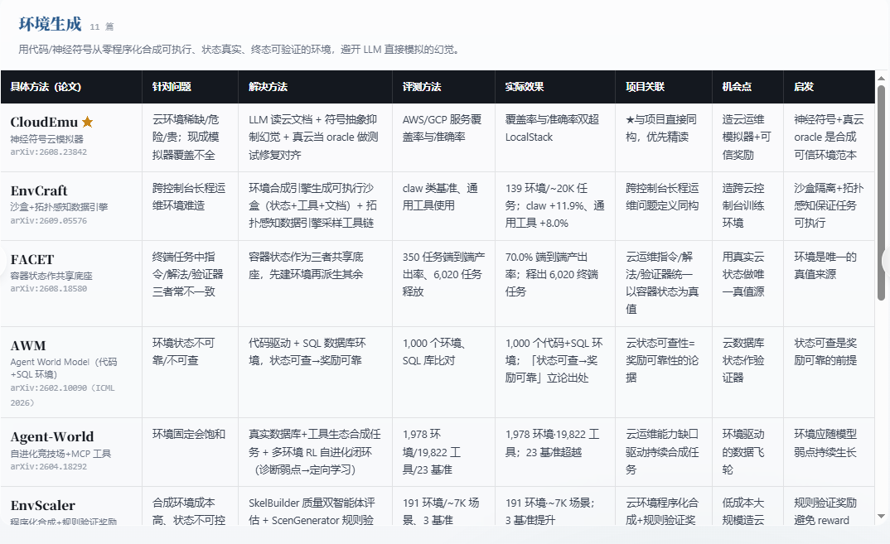

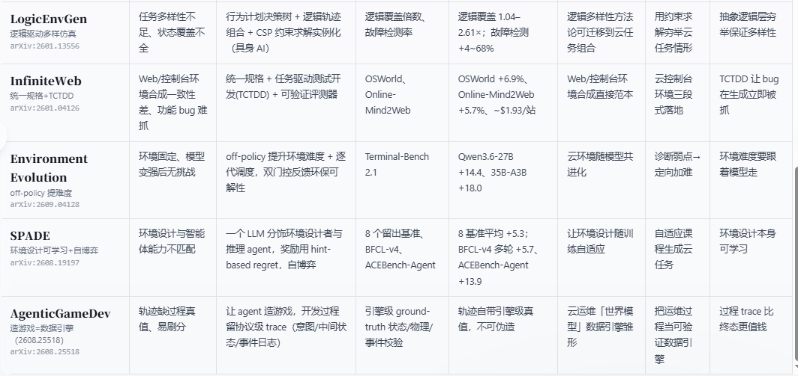

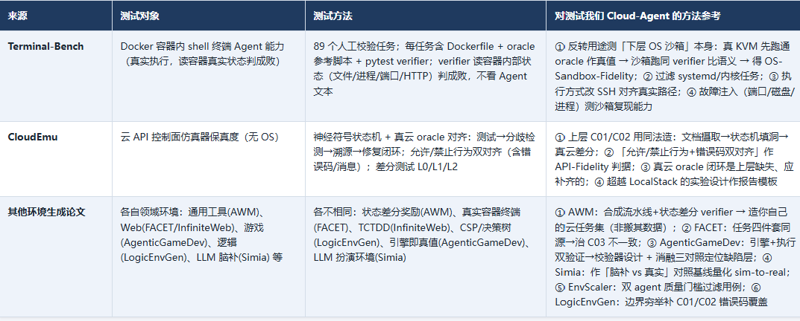

---

## 参考文献

> 说明：论文类文献的 arXiv 编号沿用调研网页/工作记录中的标注体系；访问日期均为 2026-09。

**核心论文**

[1] CloudEmu：神经符号 + 真云对齐的自动云模拟器[EB/OL]. arXiv:2608.23842. https://arxiv.org/abs/2608.23842

[2] EnvCraft：沙盒 + 拓扑感知数据引擎[EB/OL]. arXiv:2609.05576. https://arxiv.org/abs/2609.05576

[3] FACET：容器化任务共享底层[EB/OL]. arXiv:2608.18580. https://arxiv.org/abs/2608.18580

[4] AWM: Agent World Model（代码 + SQL 环境）[C]// ICML 2026. arXiv:2602.10090. https://arxiv.org/abs/2602.10090

[5] Agent-World：自进化竞技场 + MCP 工具生态[EB/OL]. arXiv:2604.18292. https://arxiv.org/abs/2604.18292

[6] EnvScaler：程序化合成 + 规则验证奖励[EB/OL]. arXiv:2601.05808. https://arxiv.org/abs/2601.05808

[7] LogicEnvGen：逻辑驱动多样性环境[EB/OL]. arXiv:2601.13556. https://arxiv.org/abs/2601.13556

[8] InfiniteWeb：统一规格 + TCTDD[EB/OL]. arXiv:2601.04126. https://arxiv.org/abs/2601.04126

[9] Environment Evolution：off-policy 环境难度进化[EB/OL]. arXiv:2609.04128. https://arxiv.org/abs/2609.04128

[10] SPADE：环境设计可学习 + 自博弈[EB/OL]. arXiv:2608.19197. https://arxiv.org/abs/2608.19197

[11] AgenticGameDev：造游戏即数据引擎[EB/OL]. arXiv:2608.25518. https://arxiv.org/abs/2608.25518

[12] Simia：LLM 扮演环境的脑补式模拟[EB/OL]. arXiv:2511.01824. https://arxiv.org/abs/2511.01824

**基准、数据集与工具**

[13] Terminal-Bench Team. Terminal-Bench: 面向 shell 终端智能体的开源评测基准（2.0 版含 89 个人工校验任务）[EB/OL]. https://github.com/terminal-bench/terminal-bench

[14] LocalStack. 云 API（AWS）本地模拟器[EB/OL]. https://github.com/localstack/localstack

[15] XIE T, et al. OSWorld: Benchmarking Multimodal Agents for Open-Ended Tasks in Real Computer Environments[EB/OL]. arXiv:2404.07972. https://arxiv.org/abs/2404.07972

[16] OSU-NLP Group. Online-Mind2Web: 在线 Web 智能体评测集[EB/OL]. https://github.com/OSU-NLP-Group/Online-Mind2Web

[17] Patil S, et al. Berkeley Function Calling Leaderboard (BFCL)[EB/OL]. https://github.com/ShishirPatil/gorilla

[18] Sierra. τ-bench: A Benchmark for Tool-Agent-User Interaction in Real-World Domains[EB/OL]. arXiv:2406.12045. https://arxiv.org/abs/2406.12045
